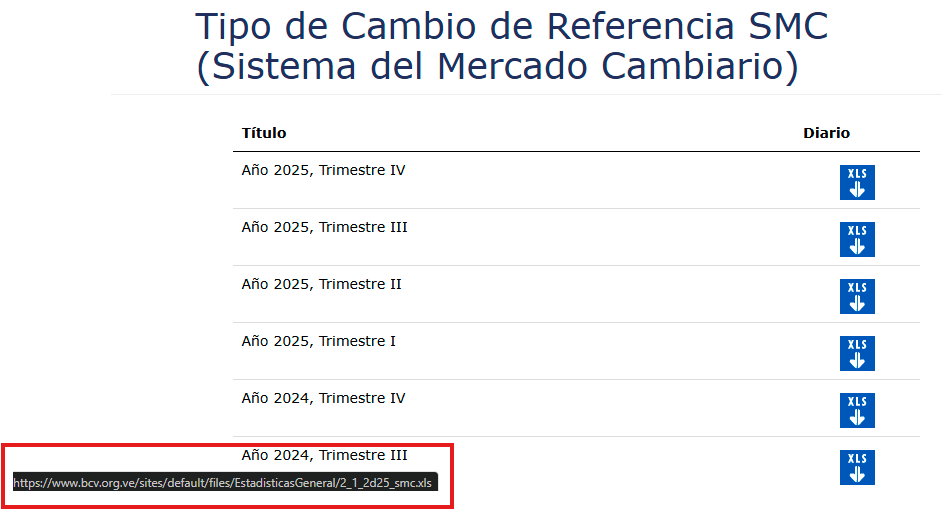

# Downloading historical files from the official BCV page

At the time of writing this doc (18/11/2025), you can download download the historical data for all Foreign Exchange Market System Reference Exchange Rates recorded by the BCV from [this page](https://www.bcv.org.ve/estadisticas/tipo-cambio-de-referencia-smc):

Each file is an Excel spreadsheet which corresponds to a quarterly-divided record of a given year, each sheet inside contains daily reference rates.

The base download URL for every file at the moment, highlighted in the image above, is `https://www.bcv.org.ve/sites/default/files/EstadisticasGeneral/`.

The resource name at the end of the URL follows the format `2_1_2XNN_smc.xls`, where `X` is a letter that identifies every quarter of the year from `A` (Q1) to `D` (Q4), and `NN` is the last two digits of the year, such as `25` for the year 2025.

To download, for example, the data for the 2nd quarter of 2024, the URL with the resource would be `https://www.bcv.org.ve/sites/default/files/EstadisticasGeneral/2_1_2b24_smc.xls`.

The `update_historic.py` script takes advantage of the known format to automatically download files.

The base URL and filename format are set by default with the known format for the script to use, but can be overridden with the `HISTORIC_DOWNLOAD_URL` and `HISTORIC_FILENAME_FORMAT` environment variables if the known format changes in the future or in the specific case where the files are downloaded from a different source.

The automatic download of the historical files from the BCV page is enabled with the `HISTORIC_FILE_DOWNLOAD` environment variable. When enabled, the script will attempt to download a file from the base URL with the filename format and store them in the `/input/historic` directory, where they will then be processed, otherwise the script will only process existing files in the same directory if any (i.e. if the files were manually placed there). The following additional environment variables alter the behavior of the download and process:

- `HISTORIC_DOWNLOAD_FROM_DATE` is an optional date in the `YYYY-MM-DD` format where you specify from which date you want to fetch historical data, taking advantage of automatic date-to-format conversion via the known filename format. If set, the script will attempt to fetch all matching files from the specified date up to the current date, advancing quarter quarter using the known filename pattern. Otherwise, it will only fetch the file from the current date's quarter.
  - I.e. setting it to `2023-09-10` will download the `2_1_2c23_smc.xls` file for the Q3 2023, then jumps to the next quarter from that date (Q4) to download the `2_1_2d23_smc.xls` file, and so on until it reaches the current date's quarter.
- `HISTORIC_PRESERVE_FILES` is a flag that controls whether files are preserved after the download and process. Note that the file will be deleted either if the processing and insertion to the database is successful or not. Also note that currently a given file will be redownloaded even if its already present at `/input/historic` (this is planned as a future improvement).
