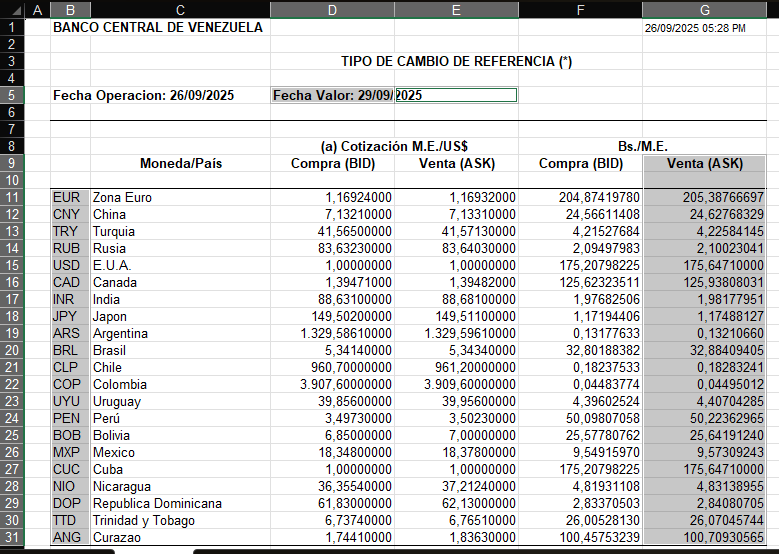

# Parsing historic data from files

At the time of writing this doc (30/09/2025), historic data comes from [this page](https://www.bcv.org.ve/estadisticas/tipo-cambio-de-referencia-smc), where you can download quarterly-divided spreadsheets containing the Foreign Exchange Market System Reference Exchange Rate (SMC: Sistema del Mercado Cambiario) with the following format:



The file you download is composed by multiple sheets, one for every day, that contains the bid and ask quotes for foreign currency relative to US Dollar (Columns D and E) and for Venezuelan Bolivar relative to foreign currency (Columns F and G) for that operation date (Cell B5) that sets the reference rate value for the following date (Cell D5) for the specific currency (Column B).

In short, for this case it is useful to get only the ask quote for Venezuelan Bolivar relative to a foreign currency for the value date, since it is the rate that everyone is going to use to know the local currency equivalent to the foreign currencies.

That's why the script `update_historic.py` gets both the value date and the rates:

## For rate parsing:

```python
excel = pd.read_excel(
    excel_path,
    usecols="B,G",
    header=8,
    index_col=0,
    skiprows=[9],
    nrows=21,
    sheet_name=None,
)
```

- We only need the B and G columns since they contain the currency code and the quote.
- We use the 9th row as header skipping the unnecessary top rows.
- To get a cleaner dataframe, we skip that 10th row since it's empty and specify just to get the 20 specific rows (+1 to include the header) for every currency.
- Since the spreadsheet contains multiple sheets, we loop through all of them with `sheet_name=None`.

## For value date parsing:

```python
df = pd.read_excel(
    excel_path,
    usecols="D",
    header=None,
    nrows=1,
    skiprows=4,
    sheet_name=sheet_name,
)
```

- For every sheet we read looping the spreadsheet, we need to get the value date. Since we are previously getting a clean dataframe, we need to temporarely read the same sheet with specific constraints.
- Since the value date in the sample format is located in the D5 cell, we partially read the file only taking 1 row in the specific column of interest, skipping 4 rows since the value is in the 5th row of the file.
- The value if then processed with strips, substrings and date parsing as needed to get the raw date.
